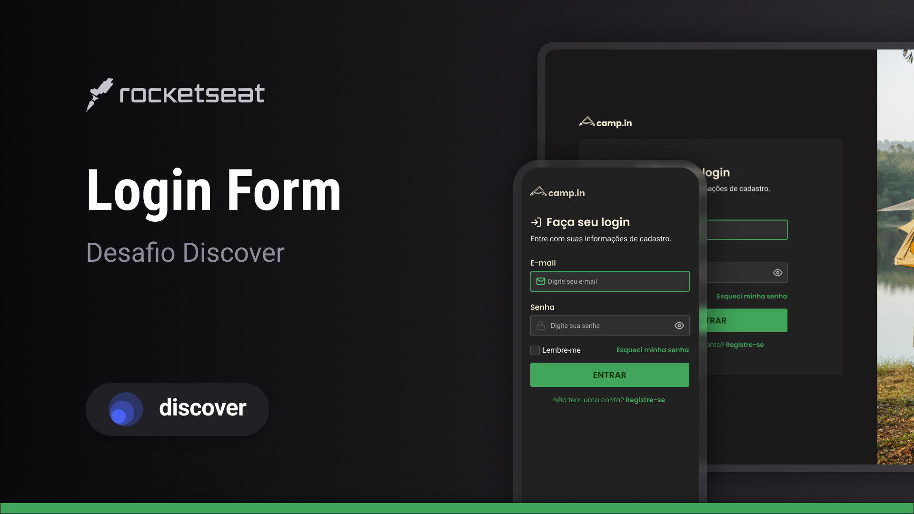

<h1 align="center"> camp.in </h1>

Projeto de um formulário de login para site de viagens / campings.  

  <a href="#📌-tecnologias">Tecnologias</a>&nbsp;&nbsp;&nbsp;|&nbsp;&nbsp;&nbsp;
  <a href="#💻-projeto">Projeto</a>&nbsp;&nbsp;&nbsp;|&nbsp;&nbsp;&nbsp;
  <a href="#-layout">Layout</a>&nbsp;&nbsp;&nbsp;|&nbsp;&nbsp;&nbsp;
  <a href="#memo-licença">Licença</a>

  

 

  

## 📌 Tecnologias

Esse projeto foi desenvolvido com as seguintes tecnologias:

- HTML e CSS;
- JavaScript;
- [Slick](https://kenwheeler.github.io/slick/) Carousel Library;
- Git e Github;
- Ionicons;
- Figma.

---

## 💻 Projeto

O camp.in é um site contendo um formulário de login para uma empresa de viagens / camping. Isso é apenas um projeto para 
 desenvolver minhas habilidades, não é um site real.

- [Acesse o projeto finalizado, online](th1agoguidi.github.io/camp.in/);

- Você pode visualizar o layout do projeto no Figma através [desse link](https://www.figma.com/community/file/1241116056018043491/login-form-desafio-discover).

<h3>⚙️ Mudanças Pessoais no Projeto</h3>

Para aprimorar minhas habilidades resolvi fazer algumas mudanças pessoais no projeto

- Botão de aparência Dark / Light;
- [ ] Carrossel de Imagens e slide entre elas automático

---

## :memo: Licença

Esse projeto está sob a licença MIT.